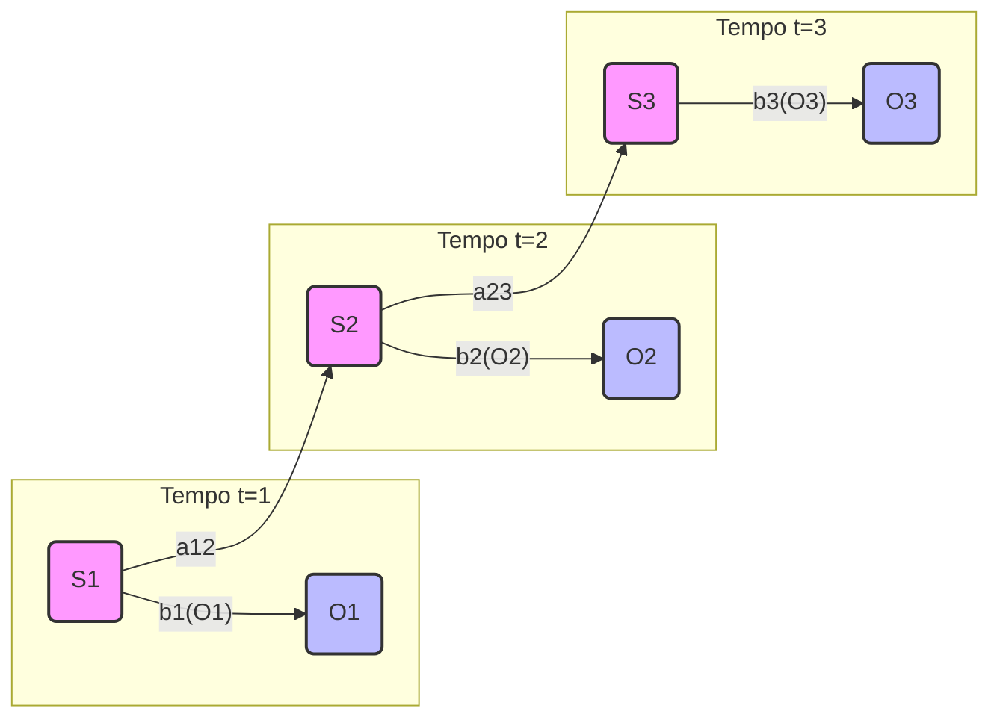

As Cadeias de Markov Ocultas, ou _Hidden Markov Models_ (HMMs), representam um avanço significativo em relação aos modelos n-grama na tentativa de modelar sequências, como a linguagem natural. A inovação fundamental dos HMMs é a introdução de uma camada de **estados ocultos** (_hidden states_) que não são diretamente observáveis, mas que influenciam as **observações** (_outputs_) que o modelo gera.

Imagine que você está tentando adivinhar o clima de uma cidade apenas observando a roupa que uma pessoa de lá veste todos os dias. As roupas são as _observações_, enquanto o clima (ensolarado, chuvoso, nublado) é o _estado oculto_. Você não vê o clima diretamente, mas pode inferi-lo a partir das roupas. Os HMMs funcionam de maneira análoga para a linguagem: as palavras são as observações, e os estados ocultos podem ser entendidos como tópicos, intenções ou categorias gramaticais subjacentes.

#### Arquitetura de um HMM

Um HMM é formalmente definido pelos seguintes componentes:

- **Estados Ocultos (Hidden States)**: Um conjunto de estados que o modelo pode assumir. Em uma tarefa de análise de sentimento, por exemplo, os estados poderiam ser "Positivo", "Negativo" e "Neutro".
    
- **Observações (Outputs)**: O conjunto de todos os resultados possíveis que o modelo pode gerar, como o vocabulário de palavras em um texto.
    
- **Matriz de Transição de Estado**: Contém as probabilidades de se mover de um estado oculto para outro. Por exemplo, a probabilidade de, após gerar uma palavra em um contexto "Positivo", a próxima palavra também vir de um contexto "Positivo".
    
- **Matriz de Emissão**: Define a probabilidade de uma determinada observação ser gerada a partir de um estado oculto específico. Por exemplo, a probabilidade da palavra "excelente" ser gerada a partir do estado "Positivo" é alta.
    
- **Distribuição Inicial de Estados**: A probabilidade de o sistema começar em cada um dos estados ocultos.

O diagrama abaixo ilustra essa estrutura, onde cada "Hidden State" pode transitar para outro e gerar uma "Observation".

Snippet de código

_Este diagrama ilustra a relação entre os estados ocultos e as observações em um HMM. Os estados ocultos formam uma cadeia de Markov, e cada estado tem uma probabilidade de emitir uma observação._

#### Algoritmos Fundamentais

Três problemas centrais são resolvidos em HMMs por algoritmos específicos:

1. **Avaliação**: Qual a probabilidade de uma sequência de observações ser gerada pelo modelo? Resolvido pelo **algoritmo Forward-Backward**.
    
2. **Decodificação**: Dada uma sequência de observações, qual a sequência mais provável de estados ocultos que a gerou? Resolvido pelo **algoritmo de Viterbi**.
    
3. **Aprendizagem**: Como ajustar os parâmetros do modelo (matrizes de transição e emissão) para maximizar a probabilidade dos dados de treinamento? Resolvido pelo **algoritmo de Baum-Welch**.

#### Aplicações e Limitações

Os HMMs foram amplamente utilizados em **reconhecimento de fala**, onde os estados ocultos representavam fonemas e as observações eram os sinais de áudio, e em **biologia computacional** para modelar sequências de DNA.

Apesar de seu sucesso, os HMMs possuem limitações importantes:

- **A Suposição de Markov**: A premissa de que o estado atual depende apenas do anterior é uma simplificação que ignora dependências de longo prazo, cruciais para a compreensão da linguagem. Uma frase como "O homem que viajou por vários países e aprendeu diversas línguas, agora vive na sua cidade natal" tem uma dependência entre "homem" e "vive" que um HMM dificilmente capturaria.
    
- **Necessidade de Dados Rotulados**: Para muitas tarefas, o treinamento de HMMs é mais eficaz com dados rotulados, o que é um processo caro e que demanda muito trabalho manual.

Essas limitações abriram caminho para o desenvolvimento de modelos mais sofisticados, como as Redes Neurais, que possuem maior capacidade de aprender representações complexas e capturar contextos mais longos.

----
### Materiais Extras para Aprofundamento

1. **Vídeo: Hidden Markov Models Explained**
    
    - **Resumo**: Este vídeo do canal "StatQuest with Josh Starmer" oferece uma explicação visual e intuitiva sobre o que são os HMMs, como funcionam e para que são utilizados, usando exemplos práticos e diagramas claros. É um excelente ponto de partida para quem prefere um aprendizado mais visual.
        
    - **Link**: [https://www.youtube.com/watch?v=v5ijNXUiR5c](https://www.google.com/search?q=https://www.youtube.com/watch%3Fv%3Dv5ijNXUiR5c)
        
2. **Artigo: "A Gentle Introduction to Hidden Markov Models"**
    
    - **Resumo**: Um artigo detalhado que aborda os conceitos matemáticos por trás dos HMMs de forma gradual. Explica os três problemas centrais (avaliação, decodificação e aprendizagem) e seus respectivos algoritmos com exemplos numéricos. Ideal para quem deseja aprofundar na teoria.
        
    - **Link**: [https://www.machinelearningplus.com/nlp/hidden-markov-model/](https://www.google.com/search?q=https://www.machinelearningplus.com/nlp/hidden-markov-model/)
        
3. **Tutorial Interativo: "The Viterbi Algorithm"**
    
    - **Resumo**: Uma página da Wikipedia que não apenas explica o algoritmo de Viterbi, mas também fornece um exemplo passo a passo e pseudocódigo. É uma referência útil para entender como, na prática, é encontrada a sequência mais provável de estados ocultos.
        
    - **Link**: [https://en.wikipedia.org/wiki/Viterbi_algorithm](https://en.wikipedia.org/wiki/Viterbi_algorithm)