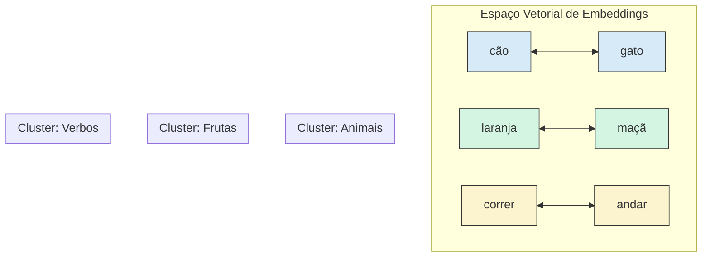

A transição dos modelos estatísticos, como os HMMs, para as **Redes Neurais Profundas (DNNs)** marca o início da era moderna da Inteligência Artificial. Enquanto os modelos anteriores enfrentavam dificuldades com a escalabilidade e a captura de nuances complexas da linguagem, as DNNs introduziram uma capacidade sem precedentes de aprender representações hierárquicas a partir de grandes volumes de dados, impulsionadas pela evolução do hardware (como as GPUs) e a disponibilidade do Big Data.

#### O que são Redes Neurais Profundas?

Inspiradas na estrutura do cérebro humano, as redes neurais são compostas por camadas interconectadas de **neurônios artificiais**. A "profundidade" refere-se à existência de múltiplas camadas entre a entrada e a saída. Cada camada recebe a saída da anterior, aplica transformações matemáticas e passa o resultado adiante. 

Esse processo permite que a rede aprenda a reconhecer padrões de forma hierárquica. Em uma tarefa de visão computacional, por exemplo, as primeiras camadas podem aprender a identificar bordas e cores, as camadas intermediárias combinam essas informações para reconhecer formas (olhos, narizes), e as camadas finais integram essas formas para identificar objetos complexos, como um rosto.

#### A Linguagem como Dado: O Papel dos Embeddings

As redes neurais operam com números, não com texto. Para preencher essa lacuna, utilizamos a técnica de **embeddings**. Um _word embedding_ é um vetor de números que representa uma palavra. O grande diferencial dessa técnica é que palavras com significados semanticamente próximos são mapeadas para vetores que estão próximos uns dos outros em um espaço vetorial multidimensional. Isso permite que o modelo generalize o aprendizado: se ele aprende algo sobre a palavra "carro", pode aplicar um conhecimento similar para a palavra "automóvel", pois seus vetores são parecidos.

O diagrama abaixo ilustra essa ideia. Palavras como "cão" e "gato" estariam próximas, assim como "laranja" e "maçã", mas os dois grupos estariam distantes entre si.

Snippet de código

_Representação simplificada de embeddings, onde palavras com semântica similar são agrupadas em clusters no espaço vetorial._

#### Redes Neurais Feedforward: A Arquitetura Inicial

A estrutura mais simples de rede neural é a **feedforward**, onde a informação flui em uma única direção, da camada de entrada para a de saída, sem ciclos ou loops. No contexto da linguagem, uma rede feedforward pode receber como entrada a concatenação dos embeddings de algumas palavras para prever a próxima. 

#### Limitações das Redes Feedforward

Apesar de serem a base para arquiteturas mais complexas, as redes feedforward apresentam duas grandes desvantagens para o processamento de sequências:

1. **Contexto Limitado**: Elas operam com uma janela de entrada de tamanho fixo (por exemplo, 3 ou 5 palavras). Qualquer informação ou dependência que esteja fora dessa janela é completamente ignorada, tornando impossível a compreensão de contextos de longo prazo. 
    
2. **Falta de Sensibilidade à Ordem**: A arquitetura feedforward, por padrão, não considera a posição das palavras na sequência. As frases "O rei venceu o servo" e "O servo venceu o rei" seriam tratadas de forma similar se apenas os embeddings das palavras fossem somados, perdendo-se o significado crucial que a ordem confere.

Essas limitações intrínsecas motivaram o desenvolvimento de arquiteturas neurais mais adequadas para dados sequenciais, como as **Redes Neurais Recorrentes (RNNs)**, que possuem mecanismos de "memória" para lidar com o fluxo e a ordem da informação.

### Materiais Extras para Aprofundamento

1. **Vídeo: "But what is a neural network?" - 3Blue1Brown**
    
    - **Resumo**: Um dos melhores vídeos introdutórios sobre redes neurais. Usando animações de alta qualidade, o vídeo explica a intuição por trás da arquitetura, como as camadas de neurônios trabalham juntas para aprender padrões complexos, e introduz conceitos como pesos e vieses de forma muito acessível.
        
    - **Link**: [https://www.youtube.com/watch?v=aircAruvnKk](https://www.youtube.com/watch?v=aircAruvnKk)
        
2. **Artigo: "Word Embeddings for NLP" - Towards Data Science**
    
    - **Resumo**: Um artigo que detalha o conceito de _word embeddings_, explicando por que são necessários e como revolucionaram o Processamento de Linguagem Natural. Aborda técnicas clássicas como Word2Vec e GloVe, que foram fundamentais para o desenvolvimento da área.
        
    - **Link**: [https://towardsdatascience.com/word-embeddings-for-nlp-652e12a32c25](https://www.google.com/search?q=https://towardsdatascience.com/word-embeddings-for-nlp-652e12a32c25)
        
3. **Blog Post Interativo: "A Neural Network Playground" - TensorFlow**
    
    - **Resumo**: Uma ferramenta interativa que permite a você construir e treinar uma rede neural diretamente no seu navegador. É possível ajustar o número de camadas, neurônios, a taxa de aprendizado e outros hiperparâmetros para ver em tempo real como a rede aprende a classificar diferentes tipos de dados. É uma forma prática e divertida de consolidar o conhecimento teórico.
        
    - **Link**: [https://playground.tensorflow.org/](https://playground.tensorflow.org/)