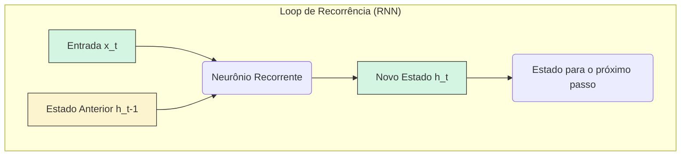

Para superar a limitação de **contexto fixo** das redes neurais feedforward, foram desenvolvidas as **Redes Neurais Recorrentes (RNNs)**. A principal inovação dessa arquitetura é a capacidade de processar sequências de dados, mantendo uma "memória" do que foi visto anteriormente para informar as decisões futuras.

#### O Desafio da Sequência e a Solução da Recorrência

A linguagem natural é, por essência, sequencial. A ordem das palavras define o significado. A RNN aborda esse desafio com um **loop de recorrência**: a saída de um passo de processamento (o _estado oculto_) é reintroduzida como parte da entrada para o próximo passo. Isso permite que a informação persista ao longo do tempo, criando um fluxo contínuo de contexto.

O diagrama a seguir ilustra essa ideia. A rede processa a entrada x_t e o estado oculto anterior h_t−1 para gerar o novo estado oculto h_t.

Snippet de código



_Fluxo de informação em uma célula de RNN, onde o estado oculto é atualizado e passado para o próximo passo de tempo._

#### As Limitações das RNNs Simples

Apesar do avanço teórico, as RNNs simples enfrentam dificuldades práticas para aprender dependências de longo prazo devido a dois problemas matemáticos que ocorrem durante o treinamento:

1. **Desvanecimento do Gradiente (Vanishing Gradient)**: Em sequências longas, o sinal de erro (gradiente) usado para atualizar os pesos da rede diminui exponencialmente à medida que se propaga para o passado. Isso faz com que a rede se torne incapaz de aprender a conexão entre palavras muito distantes.
    
2. **Explosão do Gradiente (Exploding Gradient)**: O oposto do desvanecimento, onde o gradiente cresce descontroladamente, tornando o processo de aprendizado instável e ineficaz.

Esses problemas limitam a "memória" efetiva de uma RNN simples a apenas alguns passos no tempo.

#### A Evolução: LSTM e GRU – Portões para Controlar a Memória

Para solucionar as limitações das RNNs, foram criadas arquiteturas mais robustas com mecanismos de controle de memória chamados **portões (gates)**.

- **LSTM (Long Short-Term Memory)**: É uma arquitetura de RNN que utiliza uma célula de memória mais complexa com três portões principais:
    
    - **Porta de Esquecimento (Forget Gate)**: Decide quais informações do estado anterior devem ser descartadas.
        
    - **Porta de Entrada (Input Gate)**: Determina quais novas informações da entrada atual devem ser armazenadas na célula de memória.
        
    - **Porta de Saída (Output Gate)**: Controla qual parte da memória será usada para gerar a saída (o novo estado oculto).
        
- **GRU (Gated Recurrent Unit)**: Uma versão mais simplificada da LSTM que combina as portas de esquecimento e entrada em uma única "porta de atualização". Ela possui menos parâmetros e pode ser computacionalmente mais eficiente, mantendo um desempenho comparável em muitas tarefas.
    

O diagrama abaixo representa de forma simplificada a ideia de uma célula com portões, como a LSTM.

Snippet de código

```
graph TD
    subgraph "Célula LSTM com Portões"
        direction LR
        Input[Entrada Atual] --> Gates
        PrevState[Estado Anterior] --> Gates
        Gates{Portões<br>(Esquecer, Adicionar, Sair)}
        Gates --> NewState[Novo Estado]
    end
    style Input fill:#D6EAF8,stroke:#333
    style PrevState fill:#FCF3CF,stroke:#333
    style NewState fill:#D5F5E3,stroke:#333
    style Gates fill:#EBDEF0,stroke:#333
```

_Abstração de uma célula com portões (como LSTM ou GRU) que regula o fluxo de informação, permitindo que a rede aprenda a reter e a descartar informações de forma seletiva para capturar dependências de longo prazo._

Essas arquiteturas avançadas se tornaram o padrão para tarefas de processamento de sequência por muitos anos, até a chegada do mecanismo de atenção e da arquitetura Transformer.

### Materiais Extras para Aprofundamento

1. **Artigo: "Understanding LSTM Networks" - Chris Olah's Blog**
    
    - **Resumo**: Considerado um dos melhores textos explicativos sobre LSTMs. O autor usa diagramas detalhados e uma abordagem passo a passo para desmistificar o funcionamento interno das células LSTM, incluindo suas portas e o fluxo de informação. É uma leitura essencial para quem quer entender profundamente a arquitetura.
        
    - **Link**: [https://colah.github.io/posts/2015-08-Understanding-LSTMs/](https://colah.github.io/posts/2015-08-Understanding-LSTMs/)
        
2. **Vídeo: "Recurrent Neural Networks (RNN) and Long Short-Term Memory (LSTM)" - StatQuest**
    
    - **Resumo**: Josh Starmer explica de forma clara e visual o que são RNNs, por que o desvanecimento do gradiente é um problema e como as LSTMs resolvem essa questão com seus portões. Ideal para quem busca uma compreensão intuitiva sem se aprofundar excessivamente na matemática.
        
    - **Link**: [https://www.youtube.com/watch?v=8HyCNIVRbSU](https://www.youtube.com/watch?v=8HyCNIVRbSU)
        
3. **Artigo: "The Unreasonable Effectiveness of Recurrent Neural Networks" - Andrej Karpathy's Blog**
    
    - **Resumo**: Um artigo clássico que demonstra o poder das RNNs. Andrej Karpathy treina RNNs para gerar textos com diferentes estilos, desde peças de Shakespeare até código-fonte em C. Mostra de forma prática e divertida a capacidade desses modelos de aprender padrões complexos em dados sequenciais.
        
    - **Link**: [http://karpathy.github.io/2015/05/21/rnn-effectiveness/](http://karpathy.github.io/2015/05/21/rnn-effectiveness/)