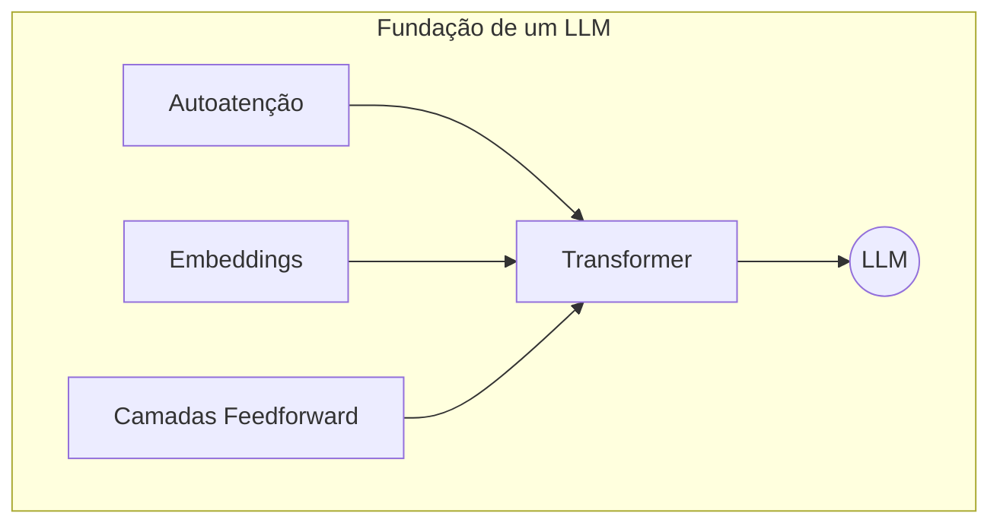

---

title: 3.6 - LLMs
draft: true
tags:
---
## Aprofundando nos LLMs: Unificando os Conceitos

Esta artigo consolida todo o conhecimento adquirido sobre a evolução da IA, culminando nos **LLMs (Large Language Models)**, o termo usado para descrever os modelos de linguagem de grande escala que dominam a tecnologia atual, como o ChatGPT e o Gemini.

### O Que São LLMs?

LLMs são modelos treinados com **bilhões de parâmetros** em um **volume massivo de dados de texto** (livros, sites, fóruns, códigos-fonte). O objetivo deles não é apenas memorizar padrões, mas entender profundamente a contextualização e a estrutura da linguagem para realizar tarefas que exigem fluência, coerência e adaptabilidade.

### A Base Técnica: O Papel do Transformer

A arquitetura fundamental por trás da maioria dos LLMs é o **Transformer**. Eles operam com base em três pilares que já estudamos:

1. **Autoatenção (Self-Attention):** Permite que cada token (unidade de texto) preste atenção e pese a importância de todos os outros tokens na conversa ou no texto, capturando o contexto de forma dinâmica.
    
2. **Embeddings:** Representam os tokens como vetores numéricos em um espaço multidimensional, permitindo que o modelo entenda as relações de proximidade e significado entre eles.
    
3. **Camadas Feedforward Empilhadas:** Múltiplas camadas que processam a informação em paralelo, permitindo que o modelo aprenda padrões complexos e profundos.
    

Snippet de código

### O Processo de Treinamento

O treinamento de um LLM é um processo multifásico:

1. **Pré-treinamento:** O modelo é exposto a bilhões de tokens de diversas fontes para aprender, de forma auto-supervisionada, os padrões, a gramática e o conhecimento geral. É nesta fase que ele aprende a "prever a próxima palavra" ou "preencher lacunas".
    
2. **Fine-Tuning (Ajuste Fino):** Após o pré-treinamento, o modelo pode ser refinado (tunado) de forma supervisionada para tarefas específicas, como classificação de texto, resumo ou resposta a perguntas em um domínio particular.
    
3. **RLHF (Reinforcement Learning from Human Feedback):** Uma camada adicional de treinamento onde o modelo é ajustado com base no feedback humano. Os usuários avaliam as respostas do modelo, e esse feedback é usado para reforçar comportamentos desejáveis (respostas úteis, seguras e precisas), como acontece com o ChatGPT.
    

### Capacidades dos LLMs

- **Geração de Texto:** Criar textos fluentes e coerentes, imitar estilos de escrita e gerar respostas contextualizadas.
    
- **Compreensão Semântica:** Realizar resumo automático, análise de sentimento, tradução e responder a perguntas.
    
- **Capacidades Emergentes:** Habilidades que surgem com a escala, como:
    
    - **Raciocínio Multi-Etapas:** Resolver problemas lógicos que exigem uma sequência de passos.
        
    - **Aprendizado com Poucos Exemplos (Few-Shot e Zero-Shot):** Realizar tarefas novas com pouquíssima ou nenhuma instrução específica.
        

### Exemplos de LLMs e Suas Especialidades (GPT vs. BERT)

"LLM" é uma categoria, não um modelo único. Diferentes LLMs são otimizados para diferentes tarefas:

- **Família GPT (OpenAI):**
    
    - **Significado:** _Generative Pre-trained Transformer_.
        
    - **Arquitetura:** Modelo **autorregressivo** e **unidirecional** (da esquerda para a direita).
        
    - **Foco:** **Geração de texto**. É treinado para prever a próxima palavra, o que o torna excelente para chatbots, criação de conteúdo e assistentes virtuais (ChatGPT, GitHub Copilot).
        
- **Família BERT (Google):**
    
    - **Significado:** _Bidirectional Encoder Representations from Transformers_.
        
    - **Arquitetura:** Modelo **bidirecional**.
        
    - **Foco:** **Compreensão de texto**. É treinado para preencher lacunas, analisando o contexto de antes e depois de uma palavra. Não é ideal para gerar texto, mas é extremamente poderoso para mecanismos de busca, análise de sentimento, classificação e extração de informações.
        

### A Importância dos LLMs

Os LLMs representam uma mudança de paradigma:

- Substituem múltiplos modelos específicos por **um único modelo generalista** que pode ser adaptado.
    
- Vão além da frequência de palavras, aprendendo **representações semânticas** profundas.
    
- **Adaptam-se a novos contextos** com poucos exemplos, aproximando-se da flexibilidade do raciocínio humano.
    

### Perguntas e Respostas para Aprofundamento

1. **Quais são os três componentes técnicos fundamentais da arquitetura Transformer que formam a base dos LLMs, conforme explicado na aula?**
    
    - **Gabarito:** Os três componentes são: 1) **Autoatenção**, que permite que cada token analise e se relacione com todos os outros tokens da sequência; 2) **Embeddings**, que são as representações vetoriais dos tokens; e 3) **Camadas Feedforward Empilhadas**, que processam os dados em paralelo para aprender padrões complexos.
        
2. **Descreva o processo de treinamento de um LLM em três etapas principais mencionadas na aula.**
    
    - **Gabarito:** As três etapas são: 1) **Pré-treinamento**, uma fase massiva e auto-supervisionada com vastos volumes de texto para aprendizado geral; 2) **Fine-Tuning**, um refinamento supervisionado para especializar o modelo em tarefas específicas; e 3) **RLHF (Reinforcement Learning from Human Feedback)**, um aprendizado de reforço contínuo com base nas preferências e correções de usuários humanos.
        
3. **Qual é a principal diferença funcional e de arquitetura entre os modelos da família GPT e BERT?**
    
    - **Gabarito:** A principal diferença é que **GPT** é um modelo **generativo**, com uma arquitetura **unidirecional** (autorregressiva) otimizada para prever a próxima palavra e criar texto. Em contrapartida, **BERT** é um modelo de **compreensão**, com uma arquitetura **bidirecional** que analisa o contexto completo (antes e depois) para entender e classificar texto, sendo ideal para tarefas como busca e análise de sentimento.
        
4. **O que são as "capacidades emergentes" de um LLM e dê um exemplo mencionado na aula, como o "few-shot learning".**
    
    - **Gabarito:** Capacidades emergentes são habilidades complexas, como raciocínio lógico, que não são programadas diretamente, mas que surgem quando o modelo atinge uma escala massiva. Um exemplo é o **"few-shot learning"** (ou "fioixote", como mencionado foneticamente na aula), que é a capacidade do modelo de realizar uma nova tarefa com pouquíssimos exemplos, demonstrando uma forma de generalização e adaptação.
        
5. **Para qual tipo de tarefa o modelo BERT é considerado ideal, e por que sua natureza bidirecional é uma vantagem nesses casos?**
    
    - **Gabarito:** O BERT é ideal para tarefas de **compreensão profunda**, como análise de sentimento, classificação de texto, extração de informação e mecanismos de busca. Sua natureza bidirecional é uma vantagem crucial porque, para entender o verdadeiro significado de uma palavra em uma frase, é essencial considerar o contexto que vem tanto antes quanto depois dela. Isso lhe confere uma compreensão mais robusta e precisa do que um modelo unidirecional.
        

### Materiais Extras para Aprofundamento

1. **Paper: "Attention Is All You Need" (Vaswani et al., 2017)**
    
    - **Resumo:** O artigo científico que introduziu a arquitetura Transformer, a base de todos os LLMs modernos. Uma leitura técnica, mas essencial para entender a origem de tudo.
        
    - **Link:** [https://arxiv.org/abs/1706.03762](https://arxiv.org/abs/1706.03762)
        
2. **Blog Post: "The Illustrated Transformer" por Jay Alammar**
    
    - **Resumo:** Um guia visual e intuitivo que explica o funcionamento interno da arquitetura Transformer passo a passo. Altamente recomendado para quem quer visualizar os conceitos de atenção, queries, keys e values.
        
    - **Link:** [http://jalammar.github.io/illustrated-transformer/](http://jalammar.github.io/illustrated-transformer/)
        
3. **Paper: "BERT: Pre-training of Deep Bidirectional Transformers for Language Understanding" (Devlin et al., 2018)**
    
    - **Resumo:** O artigo original que apresentou o BERT, detalhando o conceito de pré-treinamento bidirecional e como ele revolucionou as tarefas de compreensão de linguagem natural (NLU).
        
    - **Link:** [https://arxiv.org/abs/1810.04805](https://arxiv.org/abs/1810.04805)