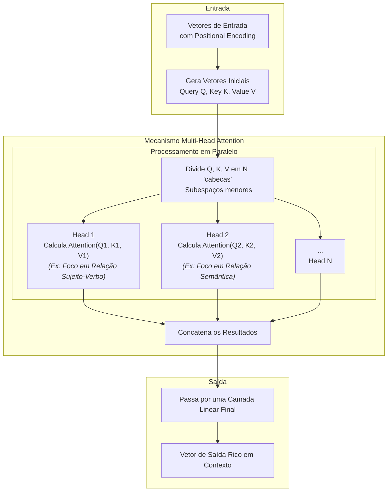

LLMs modernos são uma evolução direta da arquitetura Transformer. Uma das melhorias mais significativas que os tornam tão poderosos é a sofisticação de sua camada de atenção. Eles evoluíram do conceito de "Single-Head Attention" para **Multi-Head Attention**.

#### Entendendo o Single-Head Attention (Atenção Simples)

Como vimos, a atenção funciona calculando a relevância entre as palavras (tokens) em uma sequência. A "Single-Head Attention" faz isso a partir de uma única perspectiva. O cálculo fundamental por trás disso é:

$$
Attention(Q,K,V)=softmax \left(\frac {QK^{T}}{\sqrt{d_k}} \right)V
$$

Onde **Q**, **K** e **V** são vetores que representam três papéis distintos para cada palavra:

- **Query (Q - Consulta):** A palavra atual buscando por contexto. É como se ela perguntasse: "Para entender a mim mesma, para quais outras palavras na frase eu deveria prestar atenção?".
    
- **Key (K - Chave):** A "etiqueta" ou "identidade" de cada palavra na frase. Responde à consulta dizendo: "Eu sou relevante para sua busca".
    
- **Value (V - Valor):** O conteúdo ou significado real da palavra. Uma vez que uma palavra é considerada relevante (através da sua Chave), é o seu Valor que é efetivamente passado adiante para enriquecer o contexto da palavra que fez a Consulta.
    

**Analogia da Aula:**

- **Frase:** "...ela é a Maria..."
    
- **Query da palavra 'ela':** "Quem sou eu neste contexto?".
    
- **Key da palavra 'Maria':** Se apresenta como uma identidade relevante.
    
- **Value da palavra 'Maria':** Oferece o significado "Maria" para a palavra "ela".
    

A limitação é que essa análise ocorre de uma só forma, sob uma única "perspectiva", o que pode fazer com que nuances da linguagem (como ironia, ambiguidade ou diferentes relações sintáticas) se percam.

#### O Salto para Multi-Head Attention (Atenção de Múltiplas Cabeças)

A Multi-Head Attention resolve a limitação da atenção simples ao permitir que o modelo analise a frase de **múltiplas perspectivas simultaneamente**. Em vez de ter um único especialista analisando a frase, o modelo agora tem um "comitê de especialistas" (as "cabeças"), onde cada um foca em um aspecto diferente.

**Representação Gráfica do Processo em Mermaid:**

Snippet de código

**Explicação do Diagrama:**

1. **Geração dos Vetores Q, K, V:** Assim como na atenção simples, a entrada gera os vetores Query, Key e Value.
    
2. **Divisão em "Cabeças":** A grande diferença começa aqui. Esses vetores são divididos em `N` pedaços menores. Cada conjunto de pedaços (Qn, Kn, Vn) se torna uma "cabeça" de atenção independente.
    
3. **Processamento em Paralelo:** Todas as cabeças calculam a atenção ao mesmo tempo, mas de forma independente. Cada cabeça pode aprender a focar em diferentes tipos de relações. Por exemplo:
    
    - **Head 1:** Pode se especializar em concordância gramatical (sujeito-verbo).
        
    - **Head 2:** Pode focar em relações semânticas (sinônimos, antônimos).
        
    - **Head 3:** Pode identificar referências pronominais ("ela" se refere a "Maria").
        
4. **Concatenação e Saída:** Os resultados de todas as cabeças são juntados (concatenados) e passados por uma camada neural final. O resultado é um único vetor que representa a palavra original, mas agora enriquecido com as informações de múltiplas perspectivas contextuais.
    

Essa abordagem permite que os LLMs capturem a complexidade da linguagem humana de forma muito mais profunda, sendo um pilar fundamental para seu desempenho.

---

### Perguntas e Respostas da Aula

1. **Pergunta:** Qual é a principal limitação do "Single-Head Attention" que o "Multi-Head Attention" se propõe a resolver?
    
    - **Resposta:** A principal limitação é que o "Single-Head Attention" analisa as relações de uma sequência a partir de uma única perspectiva, o que pode levar à perda de nuances importantes da linguagem, como ironia, ambiguidade ou diferentes tipos de relações sintáticas. O "Multi-Head Attention" resolve isso processando a informação em paralelo a partir de múltiplas perspectivas.
        
2. **Pergunta:** Na arquitetura de atenção, o que os vetores Query (Q), Key (K) e Value (V) representam conceitualmente?
    
    - **Resposta:**
        
        - **Query (Q):** Representa a palavra atual que está buscando contexto, como uma pergunta ("Para quem eu devo dar atenção?").
            
        - **Key (K):** Funciona como uma etiqueta ou identificador para as outras palavras, que respondem à "Query" indicando sua relevância.
            
        - **Value (V):** É o conteúdo ou significado real da palavra. Uma vez que a "Key" estabelece a relevância, o "Value" é a informação que é efetivamente transmitida para a palavra que fez a "Query".
            
3. **Pergunta:** Descreva o processo de funcionamento do Multi-Head Attention, desde a divisão dos vetores de entrada até a saída final.
    
    - **Resposta:** O processo começa com a criação dos vetores Q, K e V. Em seguida, esses vetores são divididos em `N` subespaços menores, e cada um alimenta uma "cabeça" de atenção. Cada cabeça calcula a pontuação de atenção de forma independente e paralela. Por fim, os resultados de todas as `N` cabeças são concatenados e passados por uma camada linear para produzir o vetor de saída final, que é uma representação rica em contexto.
        
4. **Pergunta:** Por que a capacidade de focar em diferentes tipos de relações (como concordância gramatical e semântica) em paralelo é uma vantagem tão grande para os LLMs?
    
    - **Resposta:** Porque a linguagem humana é multifacetada. Uma frase tem estrutura gramatical, significado semântico, tom emocional, referências temporais, etc. Ao analisar esses aspectos em paralelo com diferentes "cabeças", o modelo constrói uma compreensão muito mais completa e robusta do texto, permitindo-lhe lidar melhor com ambiguidades e gerar respostas mais coerentes e contextualmente apropriadas.
        
5. **Pergunta:** Qual é o papel da camada "Feedforward" que processa o resultado da Multi-Head Attention?
    
    - **Resposta:** Após a camada de Multi-Head Attention ter combinado as informações de contexto de várias perspectivas, a camada Feedforward (geralmente uma rede neural densa) processa esse vetor de saída. Sua função é realizar uma transformação não-linear adicional sobre essas representações, permitindo que o modelo aprenda padrões ainda mais complexos e abstratos a partir das informações contextuais já ricas que recebeu.
        

---

### **Materiais Extras para Aprofundamento**

1. **Artigo (com ilustrações): "The Illustrated Transformer"**
    
    - **Resumo:** Continua sendo a melhor referência visual para entender este conceito. A seção sobre Multi-Head Attention mostra de forma clara como os vetores são divididos, processados em paralelo e depois concatenados. Essencial para criar um modelo mental do fluxo.
        
    - **Link:** [https://jalammar.github.io/illustrated-transformer/](https://jalammar.github.io/illustrated-transformer/)
        
2. **Vídeo: "Multi-Head Attention" por CodeEmporium**
    
    - **Resumo:** Um vídeo focado especificamente em explicar o mecanismo de Multi-Head Attention com animações e uma abordagem passo a passo. Ajuda a solidificar a intuição por trás da divisão dos vetores e o porquê de isso ser tão poderoso.
        
    - **Link:** [https://www.youtube.com/watch?v=Kzfy5N2e6aA](https://www.google.com/search?q=https://www.youtube.com/watch%3Fv%3DKzfy5N2e6aA)
        
3. **Artigo Técnico: "Dissecting Transformers" do blog da Abzu**
    
    - **Resumo:** Para quem quer ir um pouco mais fundo na matemática e implementação, este artigo disseca a arquitetura, mostrando os cálculos e as matrizes envolvidas no processo de Multi-Head Attention de uma forma mais técnica, mas ainda didática.
        
    - **Link:** [https://www.abzu.ai/2023/03/13/dissecting-transformers-part-3-multi-head-attention/](https://www.google.com/search?q=https://www.abzu.ai/2023/03/13/dissecting-transformers-part-3-multi-head-attention/)