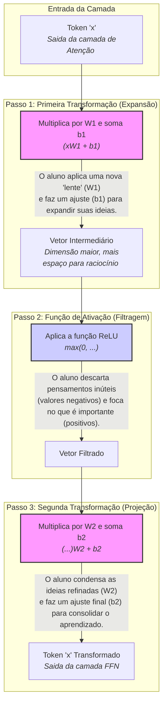

Após a camada de **Multi-Head Attention** determinar _quais_ palavras são importantes umas para as outras e criar uma representação rica em contexto, o Transformer precisa de um passo adicional para processar e aprofundar esse entendimento. É aqui que entram as **Position-wise Feedforward Layers**.

**Analogia da Aula:**

- **Multi-Head Attention:** É como uma conversa em grupo, onde todos trocam informações para entender o contexto geral.
    
- **Feedforward Layer:** É o momento da **reflexão individual** após a conversa. Cada participante (cada token) pega o que aprendeu e processa internamente para formar uma compreensão mais profunda e tomar decisões.
    

Essa camada é aplicada **independentemente a cada token** da sequência. Embora a mesma rede (com os mesmos pesos) seja usada para todos os tokens, cada um passa por ela separadamente, permitindo um "raciocínio local" sobre a informação contextualizada que recebeu da camada de atenção.

#### A Arquitetura e o Cálculo

A estrutura desta camada é uma rede neural simples, mas poderosa, composta por duas transformações lineares com uma função de ativação não-linear entre elas.

A fórmula apresentada é:

$$FFN(x)=max(0,xW_1​+b_1​)W_2​+b_2$$​

Vamos quebrar essa equação usando a analogia do "aluno" (o token `x`) que está refletindo:

**Representação Gráfica do Processo em Mermaid:**

**Explicação do Diagrama:**

1. **Primeira Transformação (Expansão):** O vetor do token (`x`) passa por uma primeira camada linear (`W1`, `b1`). Geralmente, essa camada **expande** a dimensão do vetor (ex: de 512 para 2048). Isso dá ao modelo mais "espaço" para trabalhar e aprender relações mais complexas.
    
2. **Função de Ativação ReLU (Não-Linearidade):** A função ReLU (`max(0, ...)`) é aplicada. Ela simplesmente zera todos os valores negativos. Isso é crucial porque introduz **não-linearidade**, permitindo que o modelo aprenda padrões muito mais complexos do que simples relações lineares. Na analogia, é o aluno descartando informações irrelevantes.
    
3. **Segunda Transformação (Projeção):** O vetor resultante passa por uma segunda camada linear (`W2`, `b2`) que o **projeta de volta** para a dimensão original (ex: de 2048 para 512). Isso consolida o aprendizado que ocorreu na dimensão expandida.
    

O resultado é um token com uma representação vetorial mais refinada, pronto para ser enviado para o próximo bloco do Transformer.

---

### Perguntas e Respostas da Aula

1. **Pergunta:** Utilizando a analogia da aula, qual é a diferença funcional entre a camada de "Multi-Head Attention" e a "Position-wise Feedforward Layer"?
    
    - **Resposta:** A "Multi-Head Attention" é como uma **conversa em grupo**, onde os tokens trocam informações para entender o contexto uns dos outros. A "Position-wise Feedforward Layer" é a **reflexão individual** que cada token faz após essa conversa, processando a informação recebida para aprofundar seu próprio entendimento.
        
2. **Pergunta:** Por que a não-linearidade, introduzida pela função de ativação ReLU, é tão importante nesta camada?
    
    - **Resposta:** A não-linearidade é crucial porque a camada de atenção, por si só, é em grande parte linear. Sem a função de ativação ReLU, empilhar múltiplas camadas de Transformer não aumentaria significativamente a capacidade do modelo de aprender. A não-linearidade permite que a rede aprenda relações muito mais complexas e profundas entre os tokens, o que é essencial para a compreensão da linguagem.
        
3. **Pergunta:** A mesma rede Feedforward é aplicada a todos os tokens em uma sequência. Isso significa que todos eles terão a mesma saída? Por quê?
    
    - **Resposta:** Não, eles não terão a mesma saída. Embora a rede (os pesos `W1`, `b1`, `W2`, `b2`) seja a mesma para todos, a **entrada** para a rede é diferente para cada token. Cada token chega a esta camada com um vetor de contexto único, gerado pela camada de atenção. Portanto, ao passar pela mesma função de transformação, cada token produzirá um resultado único e refinado.
        
4. **Pergunta:** Qual é o propósito das duas camadas lineares (representadas por `W1`/`b1` e `W2`/`b2`) na rede Feedforward?
    
    - **Resposta:** Elas trabalham em conjunto. A primeira camada (`W1`/`b1`) geralmente **expande** a dimensionalidade do vetor do token, criando um espaço de representação maior onde padrões mais complexos podem ser identificados. A segunda camada (`W2`/`b2`) **projeta** o vetor de volta à sua dimensão original, consolidando o conhecimento aprendido nesse espaço expandido.
        
5. **Pergunta:** O que significa o termo "Position-wise" no nome "Position-wise Feedforward Layers"?
    
    - **Resposta:** O termo "Position-wise" indica que a transformação da rede Feedforward é aplicada **independentemente a cada posição** na sequência de entrada. Ou seja, o token na posição 1 passa pela rede, o token na posição 2 passa pela mesma rede, e assim por diante, mas o cálculo para cada um não interfere diretamente no outro dentro desta camada específica.
        

---

### **Materiais Extras para Aprofundamento**

1. **Artigo (com ilustrações): "The Illustrated Transformer"**
    
    - **Resumo:** Este artigo continua sendo a referência visual definitiva. A seção sobre as camadas Feedforward mostra claramente como os vetores de cada posição passam pela mesma rede, ajudando a solidificar o conceito de "Position-wise".
        
    - **Link:** [https://jalammar.github.io/illustrated-transformer/](https://jalammar.github.io/illustrated-transformer/)
        
2. **Vídeo: "Atenção e Arquitetura Transformer" por Aceleradev**
    
    - **Resumo:** Um vídeo em português que explica a arquitetura Transformer de forma geral, mas com bons insights sobre como as diferentes camadas, incluindo a Feedforward, se conectam para formar o todo. Ajuda a contextualizar o papel dessa camada no fluxo completo.
        
    - **Link:** [https://www.youtube.com/watch?v=z_Tz2i4o-PE](https://www.google.com/search?q=https://www.youtube.com/watch%3Fv%3Dz_Tz2i4o-PE)
        
3. **Artigo: "Transformers from Scratch" por Peter Bloem**
    
    - **Resumo:** Para quem gosta de ver o código por trás dos conceitos, este post implementa um Transformer do zero em Python. A seção sobre a camada Feedforward mostra como ela é simples em sua essência (duas camadas lineares e uma ReLU), mas poderosa em sua função.
        
    - **Link:** [http://peterbloem.nl/blog/transformers](http://peterbloem.nl/blog/transformers)